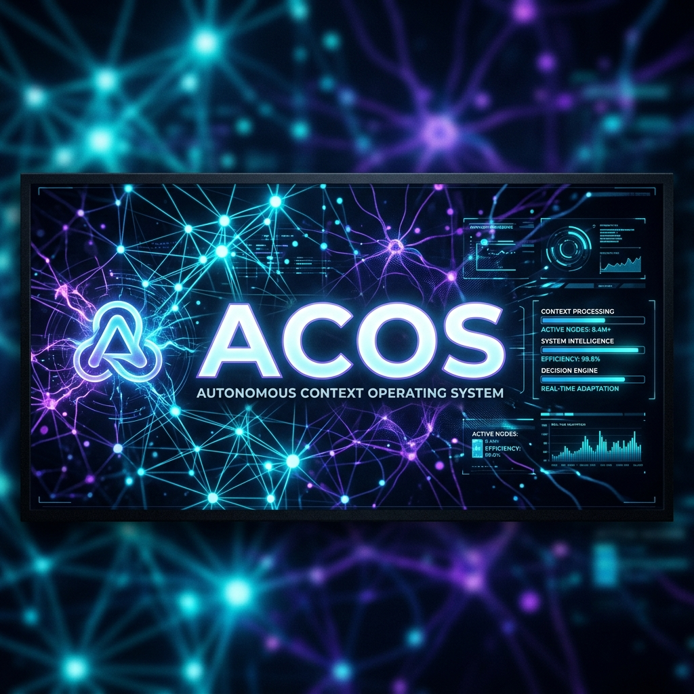
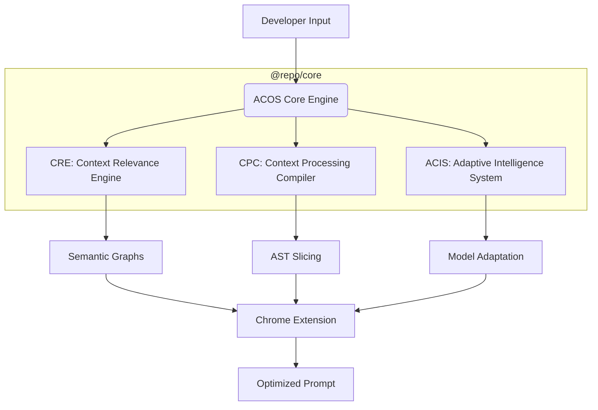

<div align="center">



# 🌌 Autonomous Context Operating System (ACOS)
### *The Universal Intelligence Layer for AI Workflows*

<a href="https://readme-typing-svg.demolab.com?font=Fira+Code&weight=600&size=22&duration=3000&pause=1000&color=00FFD1&center=true&vCenter=true&width=600&height=50&lines=Optimizing+LLM+Reasoning...;Eliminating+Token+Waste...;Slicing+Semantic+Context...;Architecting+the+Future+of+AI+DevTooling...">
  
</a>

<br/>

[](https://opensource.org/licenses/MIT)
[](https://github.com/anant9934/token-optimization-extension)
[](https://github.com/anant9934/token-optimization-extension)

<br/>

</div>

---

## 📌 Overview

**ACOS** is a deterministic, local-first intelligence layer designed to orchestrate high-value context for Large Language Models. It eliminates "Context Amnesia" and "Token Bloat" by surgically extracting only the most relevant semantic information from your codebase before it reaches the LLM.

*   **Zero Waste**: Reduces token usage by up to 80% using AST-level slicing.
*   **High Signal**: Enhances LLM reasoning by removing noise and redundant symbols.
*   **Governance**: Real-time PII detection and security scanning for every prompt.

---

## 🏗️ Project Architecture

ACOS operates as a modular monorepo, separating core intelligence from client-side orchestration.



---

## ⚙️ Installation & Setup

Follow these steps to get ACOS running in your local development environment.

### 1. Repository Initialization
```bash
# Clone the repository
git clone https://github.com/anant9934/token-optimization-extension.git
cd token-optimization-extension

# Install dependencies
npm install

# Build the core engine and extension
pnpm build
```

### 2. Adding the Extension to Chrome
To use the ACOS intelligence layer on ChatGPT, Claude, or Gemini, follow these steps:

1. Open **Google Chrome** and navigate to `chrome://extensions`.
2. Enable **Developer Mode** by toggling the switch in the top-right corner.
3. Click the **Load Unpacked** button.
4. Navigate to your project folder and select:
   `apps/chrome-extension/build/chrome-mv3-dev` (or `chrome-mv3-prod`).
5. ACOS is now active! Pin it to your toolbar for easy access.

---

## 🚀 How to Use

ACOS integrates seamlessly into your existing AI workflow with a three-layer interaction model:

### Layer 1: Passive Intelligence
As you type in ChatGPT, Claude, or Gemini, ACOS performs real-time analysis. You will see a subtle **✦ Pill** appearing near the submit button indicating the current token reduction potential.

### Layer 2: Instant Optimization
Click the **Pill** to instantly compile your prompt into a dense semantic payload. This removes redundant imports, whitespace, and irrelevant comments while preserving all logic.

### Layer 3: Command Center
For heavy-duty orchestration, use the **ACOS Command Palette** to access advanced tools like security scans, diff viewers, and aggressive compression modes.

---

## ⌨️ Keyboard Shortcuts

ACOS is built for power users. Use these shortcuts to orchestrate context at the speed of thought.

| Action | Mac Shortcut | Windows Shortcut |
| :--- | :--- | :--- |
| **Open Command Palette** | `⌘` + `Shift` + `K` | `Ctrl` + `Shift` + `K` |
| **Execute Selected Command** | `Enter` | `Enter` |
| **Navigate Palette** | `↑` / `↓` | `↑` / `↓` |
| **Close / Cancel** | `Esc` | `Esc` |
| **Toggle Sidepanel** | *Open via Palette* | *Open via Palette* |

---

## 💻 Technical Stack

<div align="center">


</div>

---

## 🤝 Contributing

1.  **Fork** the repository.
2.  **Branch**: `git checkout -b feature/amazing-feature`.
3.  **Commit**: `git commit -m "feat(core): added semantic relationship tracing"`.
4.  **Push**: `git push origin feature/amazing-feature`.
5.  **Pull Request**: Open a PR for review.

---

<div align="center">
  
### 📡 transmission_end
<p align="center">
  
</p>
</div>

