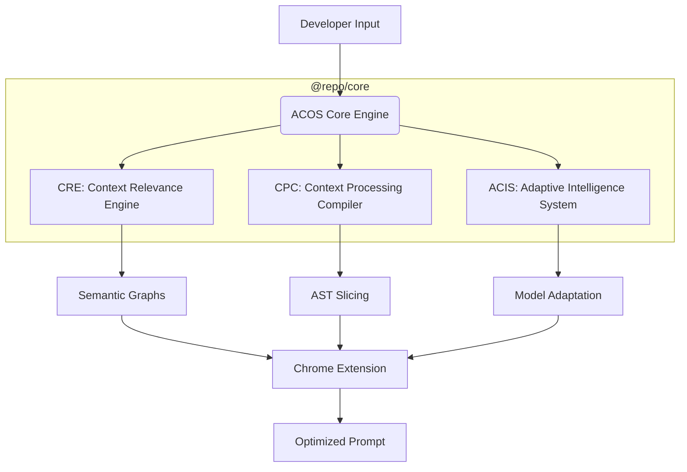

<div align="center">

# 🌌 Autonomous Context Operating System (ACOS)
### *The Universal Infrastructure for AI Cognition*

<a href="https://readme-typing-svg.demolab.com?font=Fira+Code&weight=600&size=20&duration=3000&pause=1000&color=00FFD1&center=true&vCenter=true&width=600&height=50&lines=Optimizing+LLM+Reasoning+Quality...;Eliminating+Token+Waste...;Slicing+Semantic+Context...;Architecting+the+Future+of+AI+DevTooling...">
  
</a>

<br/>

[](https://opensource.org/licenses/MIT)
[](https://github.com/anant9934/token-optimization-extension)

<br/>

</div>

---

## 📌 Overview

**ACOS** is a deterministic, local-first operating system designed to orchestrate high-value context for Large Language Models. It solves the "Context Amnesia" and "Token Bloat" problems by surgically extracting only the most relevant semantic information from your codebase before it reaches the LLM.

*   **The Problem**: Developers often paste entire files or massive chunks of code into AI chats, overwhelming the model with noise, causing hallucinations and wasting thousands of tokens.
*   **The Solution**: ACOS uses AST-level analysis and semantic graphing to "slice" your code, sending only the critical dependencies and symbols needed for the specific reasoning task.

---

## 🏗️ Project Architecture

ACOS operates as a modular monorepo, separating core intelligence from client-side orchestration.



### Core Subsystems:
*   🧠 **CRE (Context Relevance Engine)**: Deterministic scoring of symbols and files based on prompt intent.
*   ⚡ **CPC (Context Processing Compiler)**: Performs AST-driven extraction and structural compression.
*   🛡️ **Hallucination Shield**: Predictive analysis that detects missing dependencies before transmission.

---

## 🛰️ Core Components

1.  **[Chrome Extension](./apps/chrome-extension)**: A production-grade companion that intercepts prompts in ChatGPT, Claude, and Gemini to optimize them in real-time.
2.  **[Core Library](./packages/core)**: The engine room. Contains the AST parsers, token estimators, and semantic graph logic.

---

## 💻 Technical Stack

<div align="center">


</div>

---

## ⚙️ Installation & Setup

ACOS uses `pnpm` workspaces for high-performance monorepo management.

### 1. Clone & Install
```bash
git clone https://github.com/anant9934/token-optimization-extension.git
cd token-optimization-extension
pnpm install
```

### 2. Build the Core Engine
```bash
pnpm build
```

### 3. Load Chrome Extension
1. Open **Google Chrome** and navigate to `chrome://extensions`.
2. Enable **Developer Mode** (top right).
3. Click **Load Unpacked**.
4. Select the folder: `apps/chrome-extension/build/chrome-mv3-dev`.

---

## 🚀 How It Works

1.  **Paste Context**: Paste a massive block of code or a file into ChatGPT/Gemini.
2.  **Analyze**: ACOS immediately detects the content type (TypeScript, JSX, Logs) and identifies potential waste (redundant imports, whitespace).
3.  **Optimize**: Click the **✨ Optimize** button. ACOS compiles the text into a dense semantic payload, reducing tokens by up to 80% while preserving logic.
4.  **Inference**: The LLM receives high-signal context, resulting in faster, more accurate, and lower-cost responses.

---

## 🏗️ Project Structure

```bash
.
├── apps/
│   └── chrome-extension/   # Plasmo-powered Chrome extension
├── packages/
│   └── core/               # Shared logic, AST parsers, and ACOS engine
├── turbo.json              # Turborepo orchestration
└── pnpm-workspace.yaml     # Workspace configuration
```

---

## 🤝 Contributing

We follow a strictly professional open-source workflow:

1.  **Fork** the repository.
2.  **Branch**: `git checkout -b feature/amazing-feature`.
3.  **Commit**: `git commit -m "feat(core): added semantic relationship tracing"`.
4.  **Push**: `git push origin feature/amazing-feature`.
5.  **Pull Request**: Open a PR for review.

---

<div align="center">
  
### 📡 transmission_end
<p align="center">
  
</p>
</div>
